# 🎯 **لوحة متابعة DNS - DNS Monitoring Dashboard**

<div align="center">

## ⚠️ **تنبيه مهم: النطاق غير مُسجل**

[](https://whois.com)
[](https://firstlineon.com)

</div>

---

## 🔴 **الحالة الحالية: النطاق firstlineon.com غير مُسجل**

### 📊 **تقرير الحالة:**
| البند | الحالة | التفاصيل |
|-------|--------|----------|
| **تسجيل النطاق** | ❌ غير مُسجل | النطاق متاح للشراء |
| **Nameservers** | ❌ لا توجد | يتطلب تسجيل النطاق أولاً |
| **ربط Vercel** | ❌ غير ممكن | يتطلب نطاق مُسجل |
| **الموقع على النطاق** | ❌ غير متاح | لا يوجد نطاق |

---

## 📋 **الخطوات المطلوبة بالترتيب:**

### **1️⃣ تسجيل النطاق أولاً** (15-30 دقيقة)
- [ ] اختر مزود نطاقات موثوق
- [ ] ابحث عن firstlineon.com
- [ ] أكمل عملية الشراء
- [ ] احصل على بيانات الدخول

### **2️⃣ بعد التسجيل مباشرة:**
- [ ] سجل دخول لحساب النطاق
- [ ] اذهب لإعدادات DNS/Nameservers
- [ ] غير إلى:
  ```
  ns1.vercel-dns.com
  ns2.vercel-dns.com
  ```
- [ ] احفظ التغييرات

### **3️⃣ المتابعة:**
- [ ] استخدم أدوات الفحص المتوفرة
- [ ] انتظر 6-24 ساعة
- [ ] تحقق من النجاح

---

## 🛒 **مزودي النطاقات الموصى بهم:**

### **عالمياً:**
| المزود | السعر التقريبي | الرابط | المميزات |
|--------|----------------|--------|-----------|
| **Namecheap** | $8-10/سنة | [namecheap.com](https://namecheap.com) | رخيص وموثوق |
| **GoDaddy** | $12-15/سنة | [godaddy.com](https://godaddy.com) | الأكبر عالمياً |
| **Google Domains** | $12/سنة | [domains.google](https://domains.google) | بسيط وآمن |
| **Cloudflare** | $8.57/سنة | [cloudflare.com](https://cloudflare.com) | أمان إضافي |

### **محلياً (الشرق الأوسط):**
| المزود | الدولة | الرابط |
|--------|--------|--------|
| **SaudiNIC** | السعودية | [nic.sa](https://nic.sa) |
| **Tasjeel** | الإمارات | [tasjeel.ae](https://tasjeel.ae) |

---

## 🔍 **أدوات الفحص الجاهزة:**

بعد تسجيل النطاق، استخدم:

### **أدواتنا:**
- 🌐 [صفحة فحص DNS](https://delivery-form-server.vercel.app/dns-check.html)
- 📊 [API التحقق](https://delivery-form-server.vercel.app/api/check-dns)
- 🖥️ `bash monitor-dns.sh`

### **أدوات خارجية:**
- [WHOIS Lookup](https://whois.com/whois/firstlineon.com)
- [DNS Checker](https://dnschecker.org/#NS/firstlineon.com)
- [MXToolbox](https://mxtoolbox.com/SuperTool.aspx?action=dns%3afirstlineon.com)

---

## 📈 **الجدول الزمني المتوقع:**

```mermaid
gantt
    title خطة ربط النطاق
    dateFormat HH:mm
    section التسجيل
    تسجيل النطاق           :active, reg, 00:00, 30m
    section الإعداد
    تحديث Nameservers      :setup, after reg, 15m
    section الانتشار
    انتشار DNS محلي        :local, after setup, 2h
    انتشار DNS عالمي       :global, after local, 22h
```



| المرحلة | الوقت | الحالة |
|---------|-------|--------|
| تسجيل النطاق | 15-30 دقيقة | ⏳ مطلوب |
| تحديث DNS | 5 دقائق | ⏳ بعد التسجيل |
| انتشار محلي | 1-6 ساعات | ⏳ بعد التحديث |
| انتشار عالمي | 6-24 ساعة | ⏳ بعد التحديث |

---

## 💡 **نصائح مهمة:**

1. **عند التسجيل:**
   - استخدم بيانات صحيحة
   - احفظ بيانات الدخول
   - فعّل WHOIS Privacy (إن أمكن)

2. **الأسعار:**
   - تجنب العروض "المجانية" المشبوهة
   - احذر من رسوم التجديد المرتفعة
   - بعض المزودين يقدمون SSL مجاني

3. **بعد التسجيل:**
   - غيّر Nameservers فوراً
   - لا تضف A records أو CNAME
   - دع Vercel يدير كل شيء

---

## 📱 **للمتابعة المباشرة:**

```bash
# بعد تسجيل النطاق، شغّل:
bash monitor-dns.sh

# أو افتح:
https://delivery-form-server.vercel.app/dns-check.html
```

---

## 🎯 **الخلاصة:**

> **الخطوة الأولى والأهم:** تسجيل النطاق firstlineon.com
> 
> بدون نطاق مُسجل، لا يمكن إكمال أي خطوة أخرى.

---

**آخر تحديث:** 2025-07-03 04:30 AM  
**الحالة:** في انتظار تسجيل النطاق 🔴